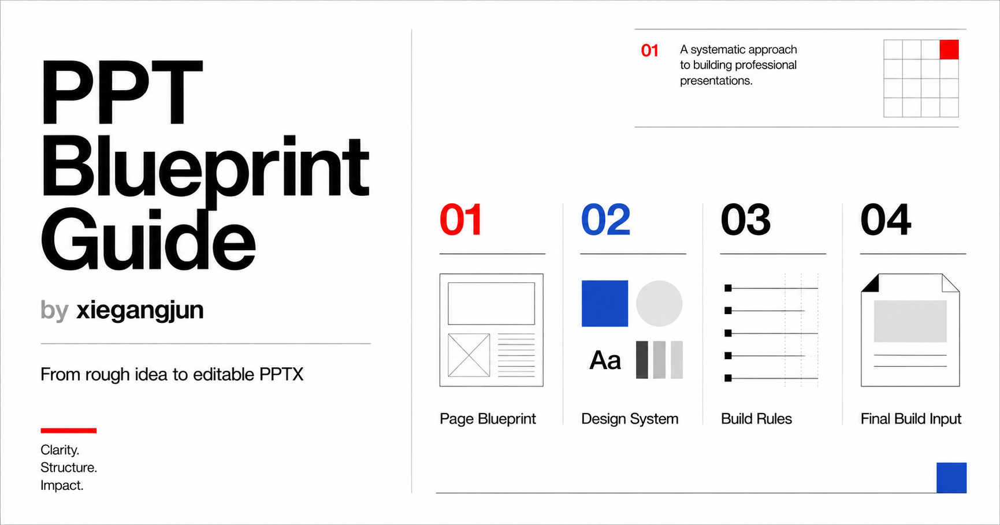

# PPT Blueprint Guide by xiegangjun



一套面向 ChatGPT 的可编辑 PPTX 生成向导。
A Page Blueprint workflow for generating editable PPTX files with ChatGPT.

这个项目提供了一套完整的 **Page Blueprint 工作流**，帮助 ChatGPT 从一个粗略主题、文档、截图或数据表出发，逐步生成结构清晰、视觉统一、内容可编辑的 PPTX 文件。

This guide helps ChatGPT turn rough topics, documents, screenshots, and data tables into structured, visually consistent, and editable PPTX files.

## Main Guide｜主文件

* [xgj-chatgpt-ppt.md](./xgj-chatgpt-ppt.md)

## What It Solves｜解决什么问题

很多 AI 生成 PPT 的问题，不是工具不够强，而是输入缺少结构：

* 主题太粗，容易直接进入制作
* 页面逻辑不清，容易变成 Word 搬家
* 设计风格没确认，容易变成通用模板
* 图表被做成图片，后期无法改数据
* 逻辑图被拼成截图，无法调整结构
* 最终生成时忘记前面的页面规划

This workflow solves these problems by making the presentation generation process explicit, structured, and editable.

## Core Concepts｜核心概念

* **Page Blueprint｜页面蓝图**
  Defines what each slide should say and how it should be structured.

* **Design System｜视觉系统**
  Defines fonts, typography scale, colors, layout grid, chart style, and image treatment.

* **Build Rules｜制作约束**
  Ensures titles, body text, charts, numbers, diagrams, and shapes remain editable.

* **Final Build Input｜最终制作输入包**
  Compresses the confirmed blueprint into the final instruction block before generating the PPTX file.

* **Native Editable Charts｜原生可编辑图表**
  Data slides should use native editable charts whenever possible, instead of image-based fake charts.

* **SmartArt / Shapes / Connectors｜可编辑逻辑图**
  Logic slides should use editable PowerPoint structures instead of flat images.

## Workflow｜工作流

```text
Topic / Materials
        ↓
Direction Selection
        ↓
Design Mode + Industry Visual System
        ↓
Page Blueprint
        ↓
Design System
        ↓
Build Rules
        ↓
Final Build Input
        ↓
Editable PPTX
```

## How to Use｜如何使用

1. 打开 `xgj-chatgpt-ppt.md`
2. 复制完整内容到 ChatGPT
3. 按照向导逐步回答问题
4. 确认 Page Blueprint、Design System、Build Rules 和 Final Build Input
5. 最后让 ChatGPT 生成可编辑 PPTX 文件

English:

1. Open `xgj-chatgpt-ppt.md`
2. Copy the full guide into ChatGPT
3. Follow the step-by-step questions
4. Confirm the Page Blueprint, Design System, Build Rules, and Final Build Input
5. Ask ChatGPT to generate the editable PPTX file

## Recommended Use Cases｜适合场景

* 工作汇报 / Business review
* 商业提案 / Business proposal
* 经营复盘 / Operation review
* 课程培训 / Training deck
* 小红书图文卡片 / Xiaohongshu content cards
* 数据分析报告 / Data report
* 方法论拆解 / Framework explanation
* AI 工具工作流分享 / AI workflow sharing

## License｜授权协议

This project is licensed under **CC BY-NC-SA 4.0**.

本项目采用 **CC BY-NC-SA 4.0** 协议。
你可以学习、分享和改编本项目，但必须保留作者署名，不得用于商业售卖、付费课程、商业插件、商业模板包或未经授权的商业化二次分发。基于本项目改编的版本，需继续采用相同协议。

Copyright © 2026 斜杠君
